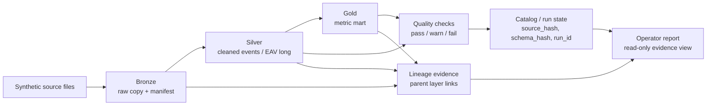
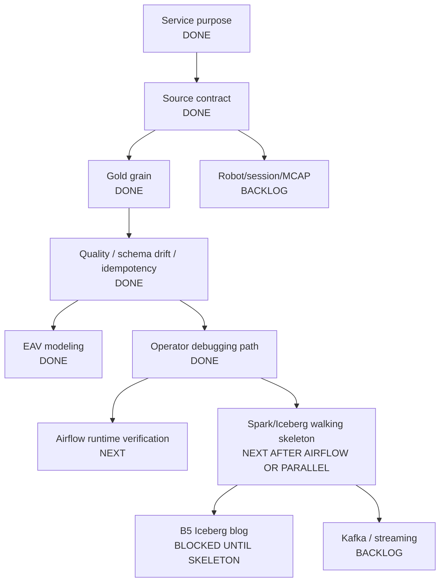

# 프로젝트 진행 지도

원문: [`PROJECT_PROGRESS_MAP.md`](PROJECT_PROGRESS_MAP.md)

이 문서는 `manufacturing-data-platform-mini`를 한 화면에서 파악하기 위한 진행 지도다.
깊은 설계 문서를 열기 전에 먼저 이 문서를 본다.

## 현재 Thesis

```text
synthetic manufacturing-style/tabular raw file을
cataloged, versioned, quality-checked dataset/mart로 바꾸고,
운영자와 reviewer가 "이 숫자가 어디서 왔는지" 설명할 수 있는 evidence를 남기는
작은 데이터 플랫폼을 만든다.
```

명시적으로 claim하지 않는 것:

```text
production manufacturing platform
Spark/Iceberg implemented
Kafka streaming implemented
real Mongo runtime verified
Airflow runtime verified
column-level lineage / OpenLineage backend
real company/customer schema usage
```

## 시스템 모양



## Workstream 상태

| Workstream | 상태 | Evidence | 현재 public claim |
|---|---:|---|---|
| Phase 1 catalog/version manifest | 구현 완료, test-covered | `tests/test_catalog.py`, `src/manufacturing_data_platform/catalog.py` | Mongo-style catalog model과 dataset version manifest 구현; real Mongo runtime은 아직 미검증 |
| Slice 1 medallion CSV pipeline | 구현 완료, test-covered | `tests/test_lakehouse_pipeline.py`, JSON CLI | synthetic CSV bronze/silver/gold + quality + schema drift + idempotent rerun |
| EAV multi-format modeling | 구현 완료, test-covered | `tests/test_eav_pipeline.py`, EAV JSON CLI | clean-room wide -> EAV -> gold flow; 새 format은 config로 onboarding |
| Operator debugging report | 구현 완료, test-covered | `tests/test_operator_report.py`, B4 published | read-only path-level evidence report; automatic RCA나 column-level lineage 아님 |
| Runtime Mongo | Backlog / environment-blocked | `mongomock` tests only | model은 구현됨; real runtime verification pending |
| Runtime Airflow | thin wrapper 존재, runtime 미검증 | `dags/manufacturing_lakehouse_daily.py` | DAG wrapper 작성됨; runtime trigger pending |
| Spark/Iceberg | design-only | question map, primer, write-semantics note | 다음 slice 설계; 아직 code 없음 |
| Kafka / streaming | Backlog | 없음 | claim하지 않음 |
| Robot/session/MCAP | Backlog | 없음 | claim하지 않음 |

## Portfolio Artifacts

| id | Topic | 상태 | Evidence |
|---|---|---:|---|
| B1 | `source_hash` idempotent rerun | DEV.to draft | idempotency tests, JSON CLI |
| B2 | schema drift as warn, not fail | DEV.to draft | schema drift tests, latest verification log |
| B3 | wide CSV -> EAV -> gold | DEV.to draft | EAV tests, processed/skipped CLI run |
| B4 | operator debugging with quality/lineage evidence | Published | operator report tests, CLI, DEV.to |
| B5 | skip -> Iceberg partition overwrite | Blocked | Spark/Iceberg walking skeleton 필요 |

## 설계 완료 지도



## 다음 단계 추천

다음 구현 slice:

```text
Airflow runtime verification
```

이유:

```text
DAG는 이미 있지만 runtime trigger가 검증되지 않았다.
Spark/Iceberg보다 작고 위험이 낮다.
README/resume caveat 하나를 실제 evidence로 닫을 수 있다.
business logic을 DAG로 옮기지 않고 orchestration만 증명하면 된다.
```

Build thesis:

```text
운영자가 같은 lakehouse CLI를 Airflow에서 trigger할 수 있어야 한다.
business_date/raw_path parameter를 넘길 수 있어야 한다.
business logic은 DAG가 아니라 CLI/pipeline module에 남아 있어야 한다.
```

Core questions:

```text
이 환경에서 Airflow가 DAG를 import할 수 있는가?
DAG가 local verification에서 쓰는 같은 CLI entrypoint를 trigger하는가?
business_date와 raw_path는 어떻게 전달되는가?
local runtime에서 output_dir은 어디를 가리키는가?
retry/idempotency는 CLI의 source_hash 로직 덕분에 여전히 안전한가?
runtime verification evidence는 무엇인가: dag import, task command, local trigger 또는 task test?
```

성공 후 claim boundary:

```text
Allowed:
  Airflow wrapper runtime was verified locally for the CLI entrypoint.

Still forbidden:
  operated production Airflow pipelines
  multi-task production DAG
  scheduler/worker deployment
```

## Spark/Iceberg Path

"Spark를 붙인다"에서 시작하지 않는다. 아래 service problem에서 시작한다.

```text
같은 business_date에 정정된 source가 들어왔을 때,
gold 결과를 중복 없이 교체하고,
재처리 전후 snapshot evidence를 남겨 비교할 수 있게 한다.
```

Walking skeleton scope:

```text
1. local SparkSession 생성
2. local Iceberg catalog/warehouse 설정
3. `business_date`로 partition된 `gold_daily_metrics` table 하나 생성
4. 한 business_date의 초기 row insert
5. 같은 business_date를 변경된 값으로 partition overwrite
6. current rows와 snapshot/history metadata 읽기
7. run_id -> snapshot_id mapping을 작은 JSON evidence file로 기록
```

Skeleton에서 제외:

```text
full bronze/silver/gold Spark rewrite
quality-on-Spark
MERGE/upsert
retention/expire
cluster deployment
production rollback
concurrent writers
Kafka streaming
```

## 시장/트렌드 관점

2026년 기준 데이터 엔지니어링 방향은 도구 하나로 수렴하지 않는다. 대체로 아래 조합으로 간다.

```text
managed warehouse/lakehouse:
  BigQuery, Snowflake, Databricks

processing engine:
  Spark for batch/large-scale processing
  Flink for streaming-heavy processing

open table format:
  Iceberg / Delta Lake / Hudi

orchestration:
  Airflow, Dagster, Prefect

quality / governance:
  dbt tests, Great Expectations, data catalog, lineage, observability
```

중요한 건 "도구를 많이 붙이는 것"이 아니라, 아래 operating loop를 설명하고 증명하는 것이다.

```text
1. 데이터가 들어온다.
2. source identity와 schema identity를 남긴다.
3. bronze/silver/gold로 상태를 나눈다.
4. quality check를 한다.
5. retry/backfill/reprocessing이 안전해야 한다.
6. lineage/catalog로 설명 가능해야 한다.
7. Airflow/Dagster로 운영한다.
8. warehouse/lakehouse에서 분석한다.
```

이 프로젝트가 이미 커버하는 신호:

```text
medallion 구조
source_hash / schema_hash
quality checks
lineage/catalog evidence
idempotent rerun
EAV / multi-format modeling
operator debugging
evidence 기반 blog / resume claim 관리
```

아직 채워야 하는 신호:

```text
Airflow runtime verification
Spark/Iceberg walking skeleton
partition overwrite / snapshot
possibly dbt-style modeling or semantic layer later
streaming/Kafka는 backlog
```

따라서 다음 방향은 Kafka나 대규모 cluster로 바로 가지 않는다.

```text
Airflow runtime 검증
-> Spark/Iceberg 작은 skeleton
-> B5: skip에서 partition overwrite로 가는 글
```

이 순서가 가장 효율적인 이유:

```text
Airflow는 현재 wrapper가 있으므로 runtime caveat를 작게 닫을 수 있다.
Spark/Iceberg는 현재 design-only라 walking skeleton evidence가 필요하다.
Iceberg는 "도구 추가"가 아니라 business_date 재처리 문제를 해결하는 storage/table layer로 설명해야 한다.
Kafka/streaming은 지금 thesis의 Core가 아니므로 backlog에 둔다.
```

## Process Rule

다음 모든 slice는 아래 순서로 진행한다.

```text
build thesis
-> wide question expansion
-> Core/Demo/Backlog/Unknown classification
-> decision note
-> test contract
-> implementation
-> verification log
-> blog/resume claim boundary
```
