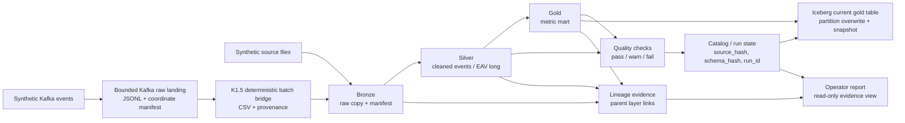
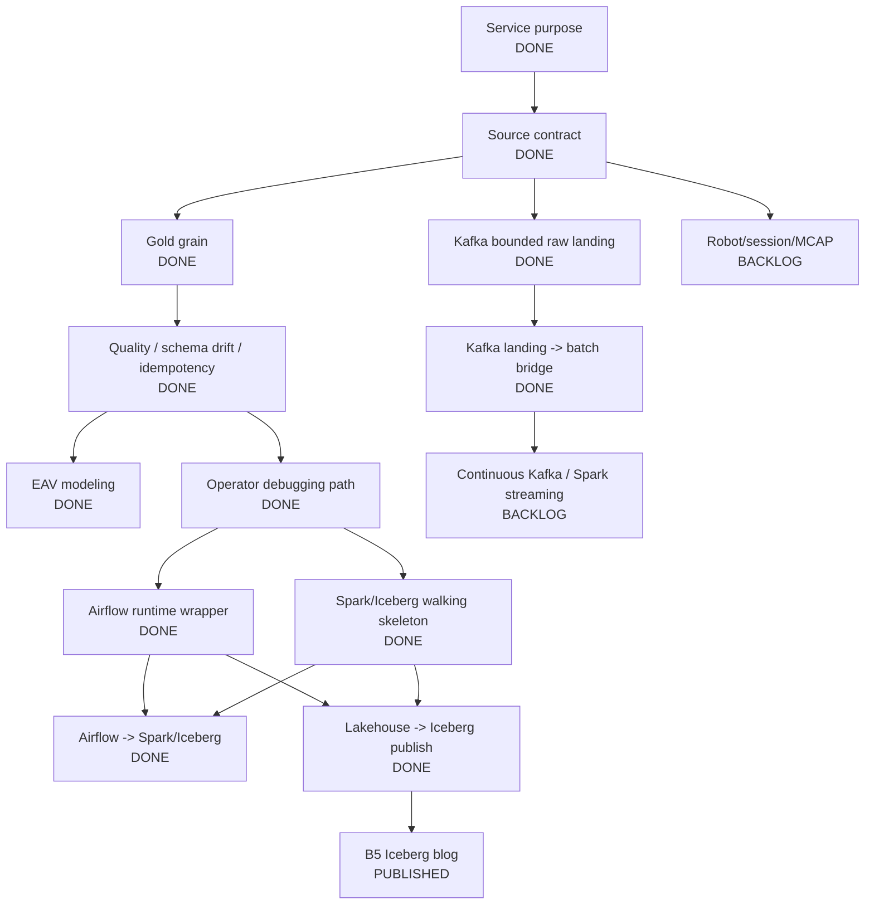

# Project Progress Map

Korean version: [`PROJECT_PROGRESS_MAP.ko.md`](PROJECT_PROGRESS_MAP.ko.md)

This document is the one-screen map for `manufacturing-data-platform-mini`.
Use it before opening the deeper design notes.

For the derivation from scenario to questions, contracts, features, and evidence, see [`learn/system-design/01-system-traceability-map.ko.md`](learn/system-design/01-system-traceability-map.ko.md).

## Current Thesis

```text
Build a synthetic manufacturing-style/tabular data platform that turns raw inputs
into cataloged, versioned, quality-checked datasets/marts, and leaves enough
evidence for operators and reviewers to explain where a number came from.
```

Not claimed:

```text
production manufacturing platform
full Spark/Iceberg medallion pipeline implemented
continuous / production Kafka streaming implemented
real Mongo runtime verified
production Airflow scheduler/worker deployment verified
column-level lineage / OpenLineage backend
real company/customer schema usage
```

## System Shape



## Workstream Status

| Workstream | Status | Evidence | Current public claim |
|---|---:|---|---|
| Phase 1 catalog/version manifest | Implemented, test-covered | `tests/test_catalog.py`, `src/manufacturing_data_platform/catalog.py` | Mongo-style catalog model and dataset version manifest; runtime Mongo still unverified |
| Slice 1 medallion CSV pipeline | Implemented, test-covered | `tests/test_lakehouse_pipeline.py`, JSON CLI | synthetic CSV bronze/silver/gold with quality, schema drift, idempotent rerun |
| EAV multi-format modeling | Implemented, test-covered | `tests/test_eav_pipeline.py`, EAV JSON CLI | clean-room wide -> EAV -> gold flow; new format by config |
| Operator debugging report | Implemented, test-covered | `tests/test_operator_report.py`, B4 published | read-only path-level evidence report; not automatic RCA or column-level lineage |
| Runtime Mongo | Backlog / environment-blocked | `mongomock` tests only | model implemented; real runtime verification pending |
| Runtime Airflow | Local runtime wrapper verified | `dags/manufacturing_lakehouse_daily.py`, `tests/test_orchestration.py`, `requirements-airflow.txt`, Airflow CLI | DAG imports and `airflow dags test` triggers the same JSON CLI task locally; same input rerun returns `skipped`; production scheduler/worker deployment not claimed |
| Spark/Iceberg | Local walking skeleton implemented, test-covered | `tests/test_spark_iceberg_skeleton.py`, Spark CLI | single gold Iceberg table with `business_date` partition overwrite + snapshot evidence; not full medallion Spark |
| Airflow-triggered Spark/Iceberg | Local scheduler path verified | `dags/manufacturing_iceberg_skeleton.py`, `tests/test_orchestration.py`, Airflow CLI/standalone, Spark/Iceberg evidence JSON | local Airflow `dags test` and development `standalone` scheduler/LocalExecutor trigger the Spark/Iceberg skeleton; production deployment and cluster Spark not claimed |
| Lakehouse -> Iceberg publish DAG | Local 2-task DAG verified | `dags/manufacturing_lakehouse_to_iceberg_daily.py`, `tests/test_publish_gold_to_iceberg.py`, Airflow `dags test` | local Airflow DAG runs JSON lakehouse CLI, then publishes the successful gold CSV to a local Iceberg table; Mongo-backed publish and full Spark rewrite not claimed |
| Kafka K1 raw ingestion | Bounded local slice implemented, broker-verified | `tests/test_kafka_ingestion.py`, `scripts/verify_kafka_k1.sh`, immutable JSONL/manifest evidence | one-broker/one-partition bounded raw landing, landing-before-commit crash recovery, replay, quarantine; not continuous/production streaming |
| Kafka K1.5 landing -> batch | Bounded local bridge implemented, runtime-verified | `tests/test_kafka_batch_adapter.py`, `scripts/verify_kafka_k1_5.sh`, adapter/quality/Iceberg evidence | deterministic one-date CSV with Kafka provenance, existing quality/gold and Iceberg publish reuse; not Structured Streaming or direct sink |
| Spark machine-event batch (S7) | Local bounded slice implemented, runtime-verified | `tests/test_spark_machine_event_batch.py`, `scripts/verify_spark_machine_event_batch.sh`, `dags/manufacturing_spark_machine_event_batch.py` | Spark re-expresses silver/gold from the K1.5 canonical CSV with verified Python parity, quality-gated `overwritePartitions()` publish (same-source skip / correction snapshot), shuffle-plan evidence; not cluster Spark, streaming, or a performance claim |
| Edge/cloud recovery (S8) | Local bounded simulation implemented, runtime-verified | `tests/test_edge_recovery.py`, `scripts/verify_edge_recovery.sh`, sealed spool + landing evidence | immutable sealed edge spool, replay through the existing K1 landing, downstream batch blocked until the sealed range is fully recovered, repeated replay changes nothing; synthetic/local/bounded simulation, not an edge gateway or OT protocol integration |
| Recovery-gated publish (S9) | Local bounded composition implemented, runtime-verified, accepted-closed | `tests/test_recovered_telemetry_publish.py`, `scripts/verify_recovered_telemetry_publish.sh`, `dags/manufacturing_recovered_telemetry_publish.py`, publish evidence JSON | one shared readiness gate reused (not reimplemented) from S8, exact sealed-event-set equality with the adapter input, existing S7 quality gate and Iceberg `business_date` overwrite reused unchanged; incomplete recovery leaves no Spark/Iceberg state, and a same-input retry creates no new snapshot and no partition overwrite (S7 still runs Spark and quality before skipping, so it is not a whole-pipeline no-op); evidence separates the current `spark_attempt_run_id` from the snapshot it reused; not a streaming sink, cluster Spark, concurrent writer, or production Airflow claim |
| Robot/session/MCAP | Backlog | none | not claimed |

## Portfolio Artifacts

| id | Topic | Status | Evidence |
|---|---|---:|---|
| B1 | `source_hash` idempotent rerun | Published | idempotency tests, JSON CLI, DEV.to |
| B2 | schema drift as warn, not fail | Published | schema drift tests, verification log, DEV.to |
| B3 | wide CSV -> EAV -> gold | Published | EAV tests, processed/skipped CLI run, DEV.to |
| B4 | operator debugging with quality/lineage evidence | Published | operator report tests, CLI, DEV.to |
| B5 | `business_date` correction with Iceberg partition overwrite | Published | Spark/Iceberg tests, snapshot evidence, DEV.to |
| B6 | Kafka landing-before-commit recovery and batch bridge | Published | K1/K1.5 broker evidence, failure injection, quality/gold/Iceberg rerun, DEV.to series |

## Design Completion Map



## Completed Airflow Slice

Implementation slice:

```text
Airflow runtime verification
```

Why:

```text
The DAG existed and the wrapper command contract was test-covered.
This slice verified local Airflow runtime import, `dags test` execution,
and a development `standalone` scheduler/LocalExecutor run for the Spark/Iceberg wrapper.
It did not change business logic; it proved orchestration only.
```

Build thesis:

```text
An operator should be able to trigger the same lakehouse CLI through Airflow,
with business_date/raw_path parameters, without moving business logic into the DAG.
```

Core questions:

```text
Can Airflow import the DAG in this environment? -> yes, with Airflow 3.3.0 in an isolated venv.
Can the DAG trigger the same CLI entrypoint used by local verification? -> yes, via `airflow dags test`.
Can scheduler/LocalExecutor run the Spark/Iceberg wrapper? -> yes, via local Airflow `standalone` + manual `dags trigger`.
Does the worker runtime have the right dependencies? -> only after installing `requirements-airflow.txt`, `requirements.txt`, and `requirements-spark.txt` into the same venv.
How are business_date and raw_path passed?
Where does output_dir point in local runtime?
Does retry/idempotency remain safe because the CLI still uses source_hash? -> yes, a repeated `dags test` returns `status="skipped"`.
What evidence proves runtime verification: dag import, task command, local trigger or task test?
```

Claim boundary after success:

```text
Allowed:
  Airflow wrapper runtime was verified locally for the CLI entrypoint.

Still forbidden:
  operated production Airflow pipelines
  multi-task production DAG
  production scheduler/worker deployment
```

Next implementation choice moves back to blog publication or a new slice.

## Spark/Iceberg Path

Do not start from "add Spark." Start from this service problem:

```text
When a corrected source arrives for the same business_date, replace that date's
gold result without duplicates and keep snapshot evidence for before/after comparison.
```

Walking skeleton scope:

```text
1. Create local SparkSession.
2. Configure a local Iceberg catalog/warehouse.
3. Create one `gold_daily_metrics` table partitioned by `business_date`.
4. Insert initial rows for one business_date.
5. Reprocess the same business_date with changed values via partition overwrite.
6. Read current rows and snapshot/history metadata.
7. Record run_id -> snapshot_id mapping in a small JSON evidence file.
```

Out of scope for the skeleton:

```text
full bronze/silver/gold Spark rewrite
quality-on-Spark
MERGE/upsert
retention/expire
cluster deployment
production rollback
concurrent writers
Kafka streaming
```

## Market / Trend Lens

The current data engineering direction is not one tool. It is a stack pattern:

```text
managed warehouse/lakehouse:
  BigQuery, Snowflake, Databricks

processing:
  Spark for batch/large-scale processing
  Flink for streaming-heavy systems

open table format:
  Iceberg / Delta Lake / Hudi

orchestration:
  Airflow, Dagster, Prefect

quality / governance:
  dbt tests, Great Expectations, catalog, lineage, observability
```

The project should therefore prove the operating loop, not collect tool names:

```text
ingest data
-> preserve source/schema identity
-> build bronze/silver/gold states
-> run quality checks
-> make retry/backfill/reprocessing safe
-> expose catalog/lineage evidence
-> orchestrate with Airflow/Dagster
-> analyze in a warehouse/lakehouse
```

This project already covers:

```text
medallion structure
source_hash / schema_hash
quality checks
catalog/lineage evidence
idempotent rerun
EAV / multi-format modeling
operator debugging
bounded Kafka raw landing with offset/replay evidence
evidence-based blog/resume claim management
```

Still to cover:

```text
production Airflow deployment remains out of scope
full Spark medallion rewrite remains out of scope
Spark/Iceberg blog/resume packaging
possibly dbt-style modeling or semantic layer later
continuous Kafka/Spark streaming remains backlog
```

Recommended sequence:

```text
failure-state forensics or portfolio promotion
-> reuse the now-verified Kafka -> batch -> quality/gold/Iceberg evidence
-> add Spark Structured Streaming only when window/watermark/latency pressure exists
```

## Process Rule

For every next slice:

```text
build thesis
-> wide question expansion
-> Core/Demo/Backlog/Unknown classification
-> decision note
-> test contract
-> implementation
-> verification log
-> blog/resume claim boundary
```
