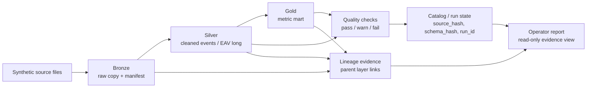
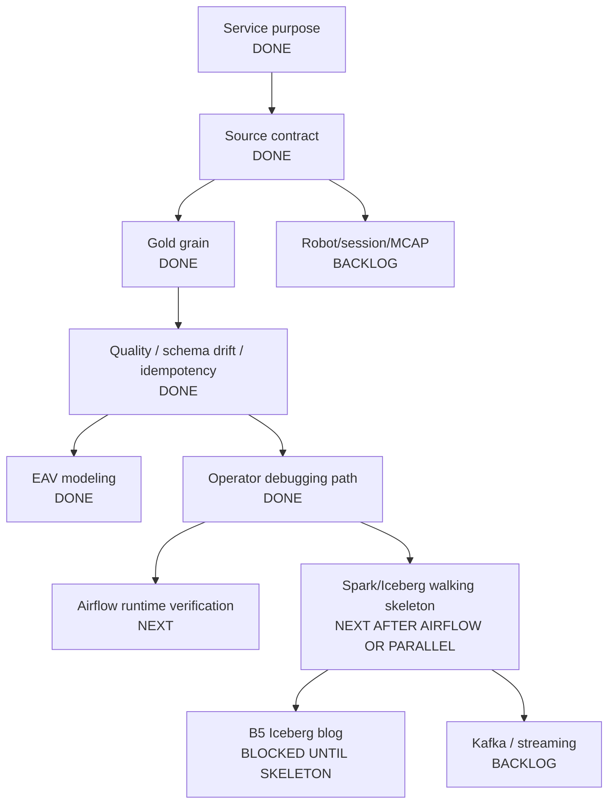

# Project Progress Map

This document is the one-screen map for `manufacturing-data-platform-mini`.
Use it before opening the deeper design notes.

## Current Thesis

```text
Build a synthetic manufacturing-style/tabular data platform that turns raw files
into cataloged, versioned, quality-checked datasets/marts, and leaves enough
evidence for operators and reviewers to explain where a number came from.
```

Not claimed:

```text
production manufacturing platform
Spark/Iceberg implemented
Kafka streaming implemented
real Mongo runtime verified
Airflow runtime verified
column-level lineage / OpenLineage backend
real company/customer schema usage
```

## System Shape



## Workstream Status

| Workstream | Status | Evidence | Current public claim |
|---|---:|---|---|
| Phase 1 catalog/version manifest | Implemented, test-covered | `tests/test_catalog.py`, `src/manufacturing_data_platform/catalog.py` | Mongo-style catalog model and dataset version manifest; runtime Mongo still unverified |
| Slice 1 medallion CSV pipeline | Implemented, test-covered | `tests/test_lakehouse_pipeline.py`, JSON CLI | synthetic CSV bronze/silver/gold with quality, schema drift, idempotent rerun |
| EAV multi-format modeling | Implemented, test-covered | `tests/test_eav_pipeline.py`, EAV JSON CLI | clean-room wide -> EAV -> gold flow; new format by config |
| Operator debugging report | Implemented, test-covered | `tests/test_operator_report.py`, B4 published | read-only path-level evidence report; not automatic RCA or column-level lineage |
| Runtime Mongo | Backlog / environment-blocked | `mongomock` tests only | model implemented; real runtime verification pending |
| Runtime Airflow | Thin wrapper exists, runtime unverified | `dags/manufacturing_lakehouse_daily.py` | DAG wrapper written; runtime trigger pending |
| Spark/Iceberg | Design-only | question map, primer, write-semantics note | next slice design; no code yet |
| Kafka / streaming | Backlog | none | not claimed |
| Robot/session/MCAP | Backlog | none | not claimed |

## Portfolio Artifacts

| id | Topic | Status | Evidence |
|---|---|---:|---|
| B1 | `source_hash` idempotent rerun | DEV.to draft | idempotency tests, JSON CLI |
| B2 | schema drift as warn, not fail | DEV.to draft | schema drift tests, latest verification log |
| B3 | wide CSV -> EAV -> gold | DEV.to draft | EAV tests, processed/skipped CLI run |
| B4 | operator debugging with quality/lineage evidence | Published | operator report tests, CLI, DEV.to |
| B5 | skip -> Iceberg partition overwrite | Blocked | requires Spark/Iceberg walking skeleton first |

## Design Completion Map



## Next Step Recommendation

Next implementation slice:

```text
Airflow runtime verification
```

Why:

```text
The DAG already exists, but runtime trigger is not verified.
This is smaller and lower-risk than Spark/Iceberg.
It closes an explicit caveat in README/resume wording.
It should not change business logic; it should prove orchestration only.
```

Build thesis:

```text
An operator should be able to trigger the same lakehouse CLI through Airflow,
with business_date/raw_path parameters, without moving business logic into the DAG.
```

Core questions:

```text
Can Airflow import the DAG in this environment?
Can the DAG trigger the same CLI entrypoint used by local verification?
How are business_date and raw_path passed?
Where does output_dir point in local runtime?
Does retry/idempotency remain safe because the CLI still uses source_hash?
What evidence proves runtime verification: dag import, task command, local trigger or task test?
```

Claim boundary after success:

```text
Allowed:
  Airflow wrapper runtime was verified locally for the CLI entrypoint.

Still forbidden:
  operated production Airflow pipelines
  multi-task production DAG
  scheduler/worker deployment
```

## Spark/Iceberg Path

Do not start from "add Spark." Start from this service problem:

```text
When a corrected source arrives for the same business_date, replace that date's
gold result without duplicates and keep snapshot evidence for before/after comparison.
```

Walking skeleton scope:

```text
1. Create local SparkSession.
2. Configure a local Iceberg catalog/warehouse.
3. Create one `gold_daily_metrics` table partitioned by `business_date`.
4. Insert initial rows for one business_date.
5. Reprocess the same business_date with changed values via partition overwrite.
6. Read current rows and snapshot/history metadata.
7. Record run_id -> snapshot_id mapping in a small JSON evidence file.
```

Out of scope for the skeleton:

```text
full bronze/silver/gold Spark rewrite
quality-on-Spark
MERGE/upsert
retention/expire
cluster deployment
production rollback
concurrent writers
Kafka streaming
```

## Process Rule

For every next slice:

```text
build thesis
-> wide question expansion
-> Core/Demo/Backlog/Unknown classification
-> decision note
-> test contract
-> implementation
-> verification log
-> blog/resume claim boundary
```

