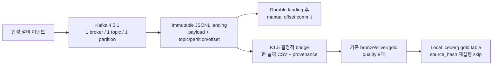

# Kafka K1/K1.5 포트폴리오 Walkthrough

## 대표 시나리오

합성 설비 이벤트 producer가 local Kafka topic 하나에 event를 쓴다. bounded consumer는 consumer-group offset을 전진시키기 전에 payload와 Kafka coordinate를 durable raw에 보존해야 한다. landing은 끝났지만 offset commit 전에 consumer가 죽는다면, 재전달된 coordinate가 accepted raw를 두 배로 만들면 안 된다.

accepted landing은 한 `business_date`의 결정적 CSV로 변환된다. 이 CSV의 정확한 hash를 기존 lakehouse pipeline의 `source_hash`로 사용해 quality, gold, rerun skip, local Iceberg publish 계약을 그대로 재사용한다.



## 실제 검증 결과

| 계약 | Runtime evidence |
|---|---|
| 정합성 | produced coordinate 5개 = accepted 4개 + quarantined 1개 |
| 장애 복구 | landing 후 commit 전 장애를 주입했고 재전달 coordinate를 기존 landing으로 재사용 |
| 제한 replay | coordinate 4개를 replay해도 정상 consumer-group progress는 전진하지 않음 |
| Batch bridge | accepted event 4개가 결정적 adapter version과 quality-passed gold 1행으로 변환 |
| 재실행 | `created -> reused`, `processed -> skipped`; gold는 계속 1행 |
| Iceberg retry | `published -> skipped`; snapshot 수는 `1 -> 1` |

공개 가능한 요약 evidence는 [`evidence/runtime-evidence.json`](evidence/runtime-evidence.json)에 있다. machine path를 포함한 전체 실행 evidence는 verification script가 local에서 생성하며 repo에는 commit하지 않는다.

## 장애 -> 조사 -> 복구

1. consumer가 offset `3`을 poll하고 immutable landing write를 끝낸다.
2. 검증기가 consumer-group offset commit 전에 의도적으로 crash를 발생시킨다.
3. group progress가 전진하지 않았으므로 Kafka가 offset `3`을 다시 전달한다.
4. landing index가 이미 저장된 coordinate를 찾아 `status=reused`를 반환한다.
5. accepted event 수는 `4`로 유지되고, consumer는 중복 write 없이 next offset `4`를 commit할 수 있다.
6. 별도의 bounded replay는 offset `0..3`을 모두 재사용하고 group commit을 수행하지 않는다.

이 결과가 증명하는 것은 bounded local at-least-once 복구 계약이다. 전원 장애 durability, multi-partition correctness, end-to-end exactly-once는 증명하지 않는다.

## 실제 Evidence 화면


화면은 [`report.html`](report.html)이 commit된 공개용 JSON을 읽어 렌더링한 것이다. 수치를 임의로 입력한 dashboard claim이 아니다.

## 재현

```bash
# pinned local Kafka KRaft broker를 시작하고 K1을 검증한다.
./scripts/verify_kafka_k1.sh

# K1 immutable file을 읽어 K1.5 deterministic bridge를 검증한다.
./scripts/verify_kafka_k1_5.sh
```

downstream local Iceberg publish에는 `requirements-spark.txt`가 필요하다. 정확한 명령과 최신 결과는 [`VERIFICATION_LOG.md`](../../../VERIFICATION_LOG.md)에 있다.

## Evidence 링크

- K1 구현: [`kafka_ingestion/landing.py`](../../../src/manufacturing_data_platform/kafka_ingestion/landing.py), [`runtime.py`](../../../src/manufacturing_data_platform/kafka_ingestion/runtime.py)
- K1.5 구현: [`batch_adapter.py`](../../../src/manufacturing_data_platform/kafka_ingestion/batch_adapter.py)
- 테스트: [`test_kafka_ingestion.py`](../../../tests/test_kafka_ingestion.py), [`test_kafka_batch_adapter.py`](../../../tests/test_kafka_batch_adapter.py)
- 설계 결정: [`kafka-offset-and-landing-commit.md`](../../../learn/reference-decisions/kafka-offset-and-landing-commit.md), [`kafka-landing-to-batch-adapter.md`](../../../learn/reference-decisions/kafka-landing-to-batch-adapter.md)

## Claim Boundary

검증됨: bounded local producer/consumer, coordinate-aware immutable landing, landing 후 commit 전 장애 주입, bounded replay, 결정적 한 날짜 batch 변환, 기존 quality/gold 재사용, local Iceberg retry evidence.

검증하지 않음: continuous streaming, multi-partition ordering/rebalance, multi-broker HA, Spark Structured Streaming, direct Kafka-to-Iceberg write, end-to-end exactly-once, production security/scale/operations.
