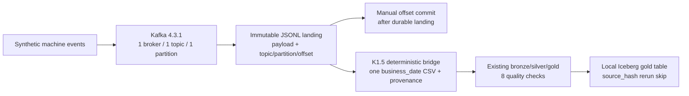
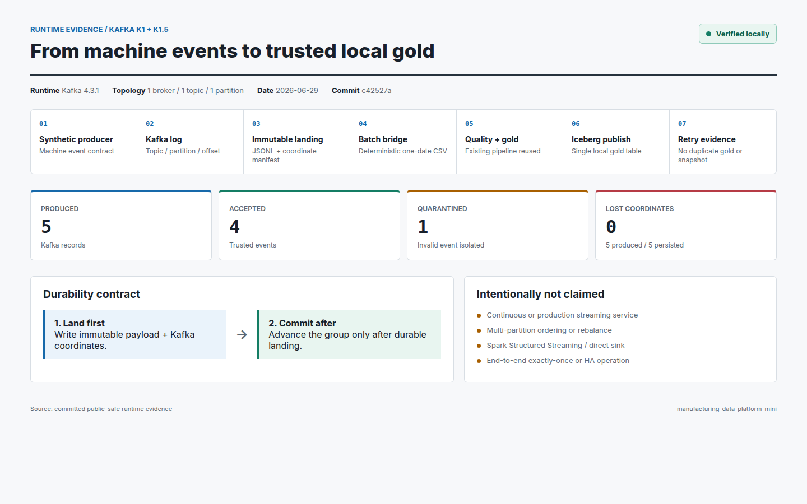
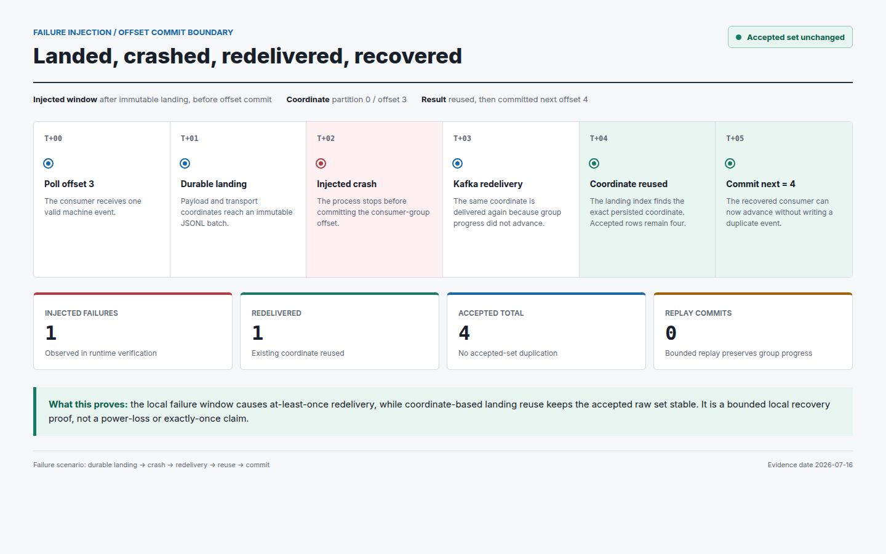
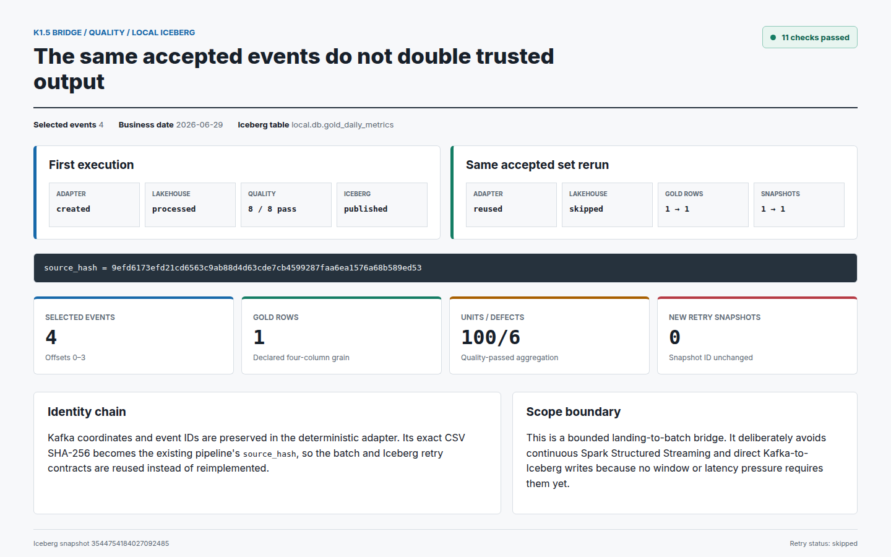

# Kafka K1/K1.5 Portfolio Walkthrough

> 한국어판: [`README.ko.md`](README.ko.md)

## Representative Scenario

A synthetic machine-event producer writes to one local Kafka topic. The bounded consumer must preserve each payload with its Kafka coordinates before it advances the consumer-group offset. If it crashes after landing but before the offset commit, the redelivered coordinate must not double the accepted raw set.

The accepted landing is then adapted into one deterministic `business_date` CSV. That exact CSV hash becomes the existing lakehouse pipeline's `source_hash`, allowing the project to reuse its quality, gold, rerun-skip, and local Iceberg publish contracts.



## Verified Runtime Results

| Contract | Runtime evidence |
|---|---|
| Reconciliation | 5 produced coordinates = 4 accepted + 1 quarantined |
| Crash recovery | Failure injected after landing and before commit; redelivery reused the persisted coordinate |
| Bounded replay | 4 coordinates replayed without advancing normal consumer-group progress |
| Batch bridge | 4 accepted events became a deterministic adapter version and one quality-passed gold row |
| Rerun | `created -> reused`, `processed -> skipped`; gold stayed at one row |
| Iceberg retry | `published -> skipped`; snapshot count stayed `1 -> 1` |

The compact public-safe evidence is [`evidence/runtime-evidence.json`](evidence/runtime-evidence.json). The full local run evidence is generated by the verification scripts and is intentionally not committed with machine-specific paths.

## Failure -> Investigation -> Recovery

1. The consumer polls offset `3` and completes the immutable landing write.
2. The verifier injects a crash before the consumer-group offset commit.
3. Kafka redelivers offset `3` because group progress did not advance.
4. The landing index recognizes the already-persisted coordinate and returns `status=reused`.
5. The accepted event count remains `4`; the consumer can commit next offset `4` without writing a duplicate.
6. A separate bounded replay of offsets `0..3` reuses all four coordinates and performs no group commit.

This proves a bounded local at-least-once recovery contract. It does not prove power-loss durability, multi-partition correctness, or end-to-end exactly-once processing.

## Actual Evidence Screens







The screens are rendered from the committed public-safe JSON through [`report.html`](report.html); they are not hand-entered dashboard claims.

## Reproduce

```bash
# Starts a pinned local Kafka KRaft broker and verifies K1.
./scripts/verify_kafka_k1.sh

# Reads K1 immutable files and verifies the deterministic K1.5 bridge.
./scripts/verify_kafka_k1_5.sh
```

The downstream local Iceberg publish requires `requirements-spark.txt`. Exact commands and the latest results are in [`VERIFICATION_LOG.md`](../../../VERIFICATION_LOG.md).

## Evidence Links

- K1 implementation: [`kafka_ingestion/landing.py`](../../../src/manufacturing_data_platform/kafka_ingestion/landing.py), [`runtime.py`](../../../src/manufacturing_data_platform/kafka_ingestion/runtime.py)
- K1.5 implementation: [`batch_adapter.py`](../../../src/manufacturing_data_platform/kafka_ingestion/batch_adapter.py)
- Tests: [`test_kafka_ingestion.py`](../../../tests/test_kafka_ingestion.py), [`test_kafka_batch_adapter.py`](../../../tests/test_kafka_batch_adapter.py)
- Design decisions: [`kafka-offset-and-landing-commit.md`](../../../learn/reference-decisions/kafka-offset-and-landing-commit.md), [`kafka-landing-to-batch-adapter.md`](../../../learn/reference-decisions/kafka-landing-to-batch-adapter.md)

## Claim Boundary

Verified: bounded local producer/consumer, immutable coordinate-aware landing, an injected landing-before-commit failure, bounded replay, deterministic one-date batch adaptation, existing quality/gold reuse, and local Iceberg retry evidence.

Not verified: continuous streaming, multi-partition ordering/rebalance, multi-broker HA, Spark Structured Streaming, direct Kafka-to-Iceberg writes, end-to-end exactly-once, or production security/scale/operations.
